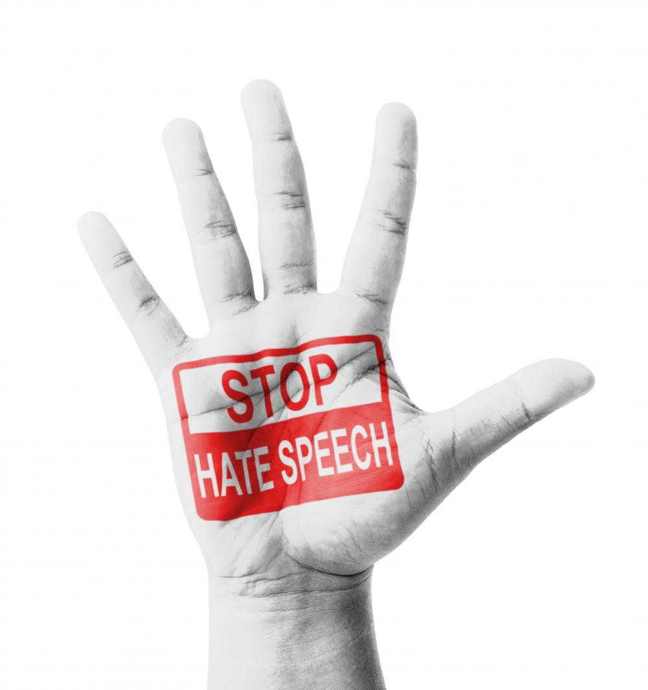

# Korean-Counter-speech-TweetIDs

The repository contains a collection of tweets IDs associated with the counter-speech written in Korean. We used [Twint](https://github.com/twintproject/twint) library to gather Tweets countering against hate speech. We classified them and annotated target group information. To comply with Twitter’s [Terms of Service](https://developer.twitter.com/en/developer-terms/agreement-and-policy), we are only publicly releasing the Tweet IDs of the collected Tweets. The data is released for non-commercial research use. 

The associated paper to this repository can be found here: [혐오와 대항: 혐오표현 탐지 모델 평가를 위한 대항표현 데이터셋 구축(Countering the hatred: The counter-speech dataset in Korean for evaluating hate speech detection models)](https://www.dbpia.co.kr/Journal/articleDetail?nodeId=NODE11063346)(**written in Korean**)

## Notes About the Data
* Consider using tools such as the [Hydrator](https://github.com/DocNow/hydrator) and [Twarc](https://github.com/DocNow/twarc) to rehydrate the Tweet IDs. Instructions for both are in the next section. 
* Hydrating may take a while, and *Tweets may have been deleted since our initial collection*. If that is the case, unfortunately you will not be able to get the deleted Tweets from querying Twitter's API. 

## How to Hydrate

### Hydrating using [Hydrator](https://github.com/DocNow/hydrator) (GUI)
Navigate to the [Hydrator github repository](https://github.com/DocNow/hydrator) and follow the instructions for installation in their README. 

### Hydrating using [Twarc](https://github.com/DocNow/twarc) (CLI)

First install Twarc and tqdm
```
pip3 install twarc
pip3 install tqdm
```

Configure Twarc with your Twitter API tokens (note you must [apply](https://developer.twitter.com/en/apply-for-access) for a Twitter developer account first in order to obtain the needed tokens). You can also configure the API tokens in the script, if unable to configure through CLI. 
```
twarc configure
```

Run the script. The hydrated Tweets will be stored in the same folder as the Tweet-ID file, and is saved as a compressed jsonl file
```
python3 hydrate.py
```

# Data Usage Agreement / How to Cite
This dataset is licensed under the Creative Commons Attribution-NonCommercial-ShareAlike 4.0 International Public License ([CC BY-NC-SA 4.0](https://creativecommons.org/licenses/by-nc-sa/4.0/)). By using this dataset, you agree to abide by the stipulations in the license, remain in compliance with Twitter’s [Terms of Service](https://developer.twitter.com/en/developer-terms/agreement-and-policy), and cite the following manuscript: 

```
박하율, 박현아, 송상헌.(2022).혐오와 대항: 혐오표현 탐지 모델 평가를 위한 대항표현 데이터셋 구축.담화와인지,29(2),1-23.
```
or

```
Park, Hayul, Park, HyunA, Song, Sanghoun.(2022).Countering the hatred: The counter-speech dataset in Korean for evaluating hate speech detection models.Discourse and Cognition,29(2),1-23.
```

BibTeX:
```bibtex
@article{edspia.NODE1106334620220531,
    Title = {혐오와 대항: 혐오표현 탐지 모델 평가를 위한 대항표현 데이터셋 구축.},
    Author = {박하율 (Park, Hayul) and 박현아 (Park, HyunA) and 송상헌 (Song, Sanghoun)},
    Journal = {담화와인지},
    Volume = {29},
    Number = {2},
    Pages = {1 - 23},
    Year = {2022}
}
```

# Inquiries

Please read through the README and the closed issues to see if your question has already been addressed first. 

If you have any questions about this dataset please contact Hayul Park at **hayul7805[at]korea[dot]ac[dot]kr**.

***
<a rel="license" href="http://creativecommons.org/licenses/by-nc-sa/4.0/"></a><br />이 저작물은 <a rel="license" href="http://creativecommons.org/licenses/by-nc-sa/4.0/">크리에이티브 커먼즈 저작자표시-비영리-동일조건변경허락 4.0 국제 라이선스</a>에 따라 이용할 수 있습니다.
